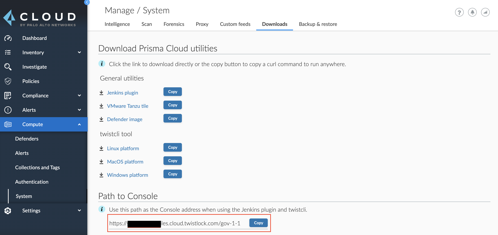

All the example API commands in these documents specify a `<CONSOLE>` variable, which represents the address for Console.
The Console address will depend on how Console was installed.

#### For SaaS Installations

To find your `<CONSOLE>` path for a SaaS environment:

1. Log into Console.
2. Navigate to **Compute** > **Manage** > **System** > **Downloads**.
3. You can find your `<CONSOLE>` path listed under **Path to Console**. Click **Copy** to quickly copy the path to your clipboard.




#### For Self-hosted Installations

For self-hosted environments, the Prisma Cloud Compute API is exposed on port `8083` (HTTPS).
This port is specified at install time in `twistlock.cfg`.

* **(Default) Kubernetes installations:** Console service is exposed by a LoadBalancer.
	
	The value for `<CONSOLE>` is the LoadBalancer followed by port `8083`:

	```
	https://<LOAD_BALANCER>:8083
	```

* **Onebox installations:** Console installed on a stand-alone host.

	The value for `<CONSOLE>` is the IP address or DNS name of the host followed by port `8083`:

	```
	https://<IP_ADDRESS>:8083
	```
