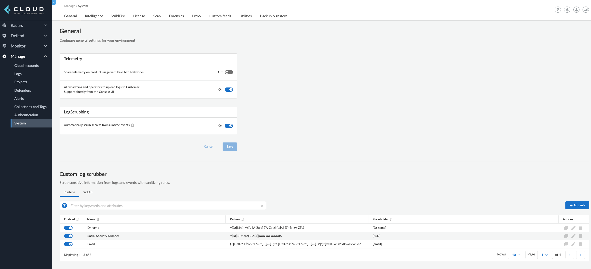

== 22.01 Release Notes

The following table outlines the release particulars:

[cols="1,4"]
|===
|Build
|22.01.838

|Code name
|Joule

|Release date
|January 10, 2022

|Type
|Major release

|SHA-256 Digest
|XXX
|===

// Besides hosting the download on the Palo Alto Networks Customer Support Portal, we also support programmatic download (e.g., curl, wget) of the release directly from our CDN:
//
// LINK

=== New features in the core platform

In addition to familiarizing yourself with the new features and enhancements in this release, review the minimum  https://docs.paloaltonetworks.com/prisma/prisma-cloud/22-01/prisma-cloud-compute-edition-admin/install/system_requirements.html[System Requirements] for versions that are tested and supported on 22.01. 

==== Enhanced scoping options for vulnerability tags

// #26291

* Vulnerability tags are predefined labels that can help you manage the vulnerabilities in your environment. With this enhancement, Prisma Cloud allows you to granularly tag vulnerabilities based on CVE ID, package, and resources. 
* Using a new management page for tags and their assignments, you will be able to assign a tag to a CVE for a single package, or for all the packages affected by it. You will also be able to assign a tag to a specific resource (e.g. ubuntu:18.04), multiple resources, resources defined using wildcards (e.g. ubuntu:*), or to all the resources across your environment. 
* For container images, you will be able to assign the tag to a base image, and Prisma Cloud will automatically assign it to all its descendant images. 

image::../_graphics/rn_vuln_tags_1.png[width=800]

image::../_graphics/rn_vuln_tags_2.png[width=800]

==== Organization-level credentials for GCP

// #25992

* Adds support for organization-level credentials for GCP. Organization-level credentials let Prisma Cloud find and scan all the projects in the organization. 
* Use organization-level credentials on various features such as cloud discovery and registry scanning, to simplify Prisma Cloud credentials management, and eliminate the need for creating credentials per project.

image::../_graphics/rn_org_level_credentials.png[width=600]

==== Log DNS queries in Forensics

// #30406

* Extends the forensics capabilities with recording DNS queries in forensics for Containers, Hosts, and App-embedded Defenders. 
* This allows customers to better investigate the incidents and events occured in the environment. 

image::../_graphics/rn_dns_query.png[width=600]

==== Cortex XDR integration

// #28960

* Adds support for sending alerts to Cortex XDR. With this integration, Cortex XDR is now a native alert provider to which Prisma Cloud Compute can send runtime audits and incidents. 

image::../_graphics/rn_cortex_xdr.png[width=600]

==== Simplified Console-Defender communication certificates management process 

// #29347

* Enhances the certificate management process for Console-Defender communication. 
** The rotation of the Console-Defender communication certificates is now automatically done by Prisma Cloud Compute one year before expiration. 
** During the year after rotation and until expiration of the old certificates, the Console is able to communicate with Defenders with both old and new certificates. This allows the entire deployment to continue functioning without the need for immediate redeployment of the Defenders.
** All the Defenders must be redeployed during this year to acquire the new certificate. UI indications are provided to ensure you know which Defenders require redeployment.
** New Defenders deployed after the rotation will be getting the new certificate.
* Updates certificate management to alert users about Console CA certificate expiration 90 days in advance, rather than 30 days.

image::../_graphics/rn_defender_certs.png[width=800]

==== Protecting Runtime events from PII/sensitive information:

// #26190

* Prisma Cloud Compute Runtime events may include sensitive information that's found in commands run inside protected workloads. Now you can filter this sensitive information and ensure that it is not included in the Runtime findings (including Forensics, Incidents, audits, etc.).
** PII sanitization is important for protecting user privacy as well as ensuring that logs comply with relevant regulations (PCI, GDPR, HIPAA, amongst others).
** There are two options to scrub your sensitive Runtime data in Prisma Cloud Compute:
*** Default scrubbing configuration: automatically scrub secrets from runtime events. This configuration will be *enabled* by default when upgrading the Console.
*** Customize your own regex to detect and scrub sensitive information, in addition to the existing capabilities in WAAS.
** Head to Manage > General to see the options that are now available.
     

==== Alerts integration with Splunk

// #27798

* You can now send alerts from Prisma Cloud Compute edition Console to Splunk. 
** This helps consolidate alert notifications from Prisma Cloud into Splunk so that your operations team can review and take action on the alerts.
** This is in addition to the existing Prisma Cloud Enterprise edition integration with Splunk.
** The Alert integration with Splunk is done via the Splunk HTTP Event Collector, using the _json source type.
     
image::../_graphics/splunk-alert-profile.png[width=800]
    
==== Immediate vulnerability alerts

// #27451

* You can now choose to send alerts immediately when new vulnerabilities are detected, in addition to the existing vulnerability alerting mechanism. 
* Immediate alerts can be sent in one of the following scenarios:
** Deploying a new image/host with vulnerabilities
** Detecting new vulnerabilities when re-scanning an existing image/host

==== Extend RBAC capabilities cross Prisma Cloud views

// #31486

* Extend RBAC capabilities cross Prisma Cloud views to limit data only to specify users and groups based on the Resource List and Collections assignments.
* These enhancements will affect the restricted views after the first scan.

==== Additional supported platforms

// #33456, #35634, #29410

The following operating systems are now supported:

* Bottlerocket OS
* RHEL 6 (vulnerability coverage only)
* Photon OS 3

The following Kubernetes distributions and configurations are now supported:

* K3s (K3s clusters are not shown in the Containers Radar and their containers are displayed under "Non-cluster containers".)
* EKS using containerd
* AKS with Windows nodes using containerd
* GKE Autopilot

=== New features in container security

==== Kubernetes auditing for EKS and AKS 

* Kubernetes auditing is now supported also for AWS EKS clusters as well as Azure AKS clusters 
* The settings configuraton was enhanced and now allows add kubernetes auditing setting records for each of cloud providers  

image::../_graphics/rn_K8S_audit_settings.png[width=800]

==== Kubernetes auditing cluster filter  

* Kubernetes auditing policy rules now allows to configure the rules using a cluster filter
* This allows cusotmers to granuluazlie their rules to the relevant specific clusters while the ingestions can be done for a wider range of clusters   

image::../_graphics/rn_K8S_audit_rule_cluster_filter.png[width=800]

==== CIS Benchamrks extended support

// #29181

* The list of supported CIS Benchamrks was extended to cover:
** CIS RedHat OpenShift Container Platform v4 Benchmark v1.1.0 support 
** CIS Docker Benchmark v1.3.1 
** CIS Kubernetes V1.20 Benchmark v1.0.0

==== Compliance for containerd containers

// #35577

* All CRI runtime compliance checks are now applicable also for containerd containers.
This feature is not supported on Bottlerocket OS.

==== Multiple image tags   

* Multiple image tags are now collected and presented in case a given image ID has differnet tags  

image::../_graphics/rn_multiple_tags_per_image.png[width=800]

==== Defend your containers running on AKS Windows containerd nodes

// #31323

* Extend the Azure Kubernetes Service (AKS) to support containers running on Windows nodes with containerd runtime:
** You can now install the Prisma Cloud Windows container defender on your AKS Windows containerd nodes.
** By installing the Defender you will be able to view the running containers and images on the Radar and leverage Prisma Cloud Runtime Defense capabilities on the running containers.
** Vulnerabilities and Compliance scanning are not supported yet.

==== Improve performance of Harbor registry scanning

// #29550

* Enhanced the Harbor Registry scanning performance

==== OpenShift clusters upgrade

// #20030

* Seamlessly upgrade the OpenShift clusters when Prisma Cloud defender is installed. This update will solve the following issue mentioned in https://access.redhat.com/solutions/5206691.
* This will be supported starting from OpenShift 4.7, and Defenders in the this version.

==== Deploy defenders on VMware Tanzu Isolation Segment

// #29370

* Adds support for deploying Defenders on VMWare Tanzu TAS isolation segments (Network and Compute Isolation).

==== Scan remote VMware Tanzu blobstores 

// #25722

* Adds support for scanning remote VMWare Tanzu TAS blobstores, located in a different cloud controller than the scanning Defender.
* This allows customers flexibility when defining the blobstore scanning Defenders, as well as helps avoid the need for deploying Defenders in all TAS environments in order to perform blobstore scanning.

image::../_graphics/rn_tas_remote_blobstore.png[width=600]

=== Agentless Security

// #30107

* Adds support for vulnerability scanning on running EC2 hosts in AWS cloud accounts.
* This allows customers to gain visibility into running or stopped vulnerable hosts in their cloud accounts without the need for deploying Defenders.
* Vulnerability policies with alert option and risk factors are applicable for agentless scanning
* Automatic scaling and easy switch between Defenders and agentless scans allows for flexibility in protection mode without user burden.
* Licensing for agentless scan is 1 credit per host

image::../_graphics/agentless_release.png[width=600]

=== New features in host security

==== Pre-deployment scan support for hosts on Azure and GCP 

// #29644

You can now scan virtual machine (VM) images on Azure and GCP to detect and harden against vulnerabilities, compliance issues, and malware at the pre-deployment stage. For example, if you have an image with the vulnerable version of the Apache log4j, the scan will detect and report this security issue before you deploy any hosts using the image.

Configure automatic scanning of the VM images for public, marketplace or private libraries across your Azure subscription or GCP projects on Defend > Vulnerabilities > Host > VM images, and review the scan results on Monitor > Host > VM Images under Vulnerabilities and Compliance.

image::../_graphics/vm_image_scan.png[width=600]

image::../_graphics/vm_image_scan_results.png[width=600]

==== Collection of cloud provider metadata for Windows virtual machines

// #17790

Windows Defenders now collect and report cloud metadata the same way as Linux Defenders.
Cloud metadata includes things such as the cloud provider where the Defender runs (e.g., AWS), the name of the host on which Defender runs, and so on.

=== New features in WAAS

==== WAAS Dashboard

// #26681

* A new WAAS dashboard name *WAAS explorer* is now available under *Monitor* -> *WAAS*.
* WAAS dashboard provides and overview of protection coverage, web application and API security posture, usage stats and insights

==== WAAS Event IDs

// #29280

* An Event ID will be assigned to all new WAAS events so that they can be referenced by end users and searched within the Event Monitor. 
* End users will be able to view event IDs as part of WAAS's block pages and in a new HTTP response header (X-Prisma-Event-Id).

==== Custom Rules - Extended Functionality

// #28252

* The "Allow" effect is now available for custom rules. When allowed, requests override actions set by other protections (application firewall, bot protection, API protection, etc.).
* The following transformation functions are available to users creating custom rules - `lowercase`, `compressWhitespace`, `removeWhitespace`, `urlQueryDecode`, `urlPathDecode`, `unicodeDecode`, `htmlEntityDecode`, `base64Decode`, `replaceComments`, `removeCommentSymbols`, `removeTags`.

==== gRPC Support

// #24614

* WAAS now supports inspection of gRPC messages

==== Scanning for Unprotected Web Applications and APIs

// #29018
* Support scanning for unprotected web applications and APIs on hosts

// #30268
* A new option lets users disable the scanning for unprotected web applications and APIs 

==== API Observations

// #25823

* JSON body content is now added to the learning model 
* Schemes will be presented as part of the observations and will be available for export in an Open API specification V3 JSON. 

=== Bug fixes

// #34233
* ServiceNow Vulnerability Response REST API script has been updated to resolve an error received while trying to send alerts.
Users receiving errors should retrieve the updated script from their upgraded Console and update it in ServiceNow.

// #33004
* `IPC_LOCK` capability has been added to container Defender to resolve an issue with runtime process monitoring for certain operating systems.

// #32931
* Vulnerability discovery dates are no longer updated following an upgrade.
This fix will only take effect for upgrades initiated after 22.01 has been deployed.
In other words, when you upgrade from 21.08 to 22.01, vulnerability disovery dates will be updated.
However, once you're based on 22.01, vulnerability discovery dates will be preserved in all subsequent upgrades to newer major and minor versions of the product.

=== DISA STIG scan findings and justifications

Every release, we perform an SCAP scan of the Prisma Cloud Compute Console and Defender images.
The process is based upon the U.S. Air Force’s Platform 1 https://repo1.dso.mil/ironbank-tools/ironbank-pipeline/-/blob/master/stages/scanning/oscap-compliance-run.sh["Repo One" OpenSCAP scan] of the Prisma Cloud Compute images.
We compare our scan results to https://ironbank.dso.mil/about[IronBank’s] latest approved UBI8-minimal scan findings.
Any discrepancies are addressed or justified.

https://docs.paloaltonetworks.com/prisma/prisma-cloud/prisma-cloud-compute-edition-public-sector/Release_Findings.html

=== Breaking changes

Be aware of the following breaking changes when upgrading to 22.01:

// #31563
* `twistcli sandbox` now exits with return value `1` if the image verdict is "failed".

// #33194
* The required permissions for the Serverless Radar, Serverless Scanning and Serverless Auto-Defend were slightly adjusted to support scanning and auto-defending KMS encrypted functions.

=== Non-breaking changes

// #35635, #34999
* Newly-added compliance checks are set to ignore on pre-existing compliance rules, regardless of severity.

=== Known issues

// #26088
* Defender containers in Defender DaemonSets still display as vulnerable after upgrade. This happens because the auto-upgrade mechanism updates the Defender binary only, not the entire image, and the vulnerabilities exist in the image base layer. To resolve the issue, redeploy all Defender DaemonSets.

// #33786
* CIS Docker Benchmark v1.3.1 recommendation 2.1 ("Run the Docker daemon as a non-root user") is not supported due to a https://github.com/moby/moby/issues/41457[bug in Docker].

=== Deprecated this release

// #34017, #27635
Operating systems:

* Ubuntu 16.04 (Xenial Xerus) is no longer supported.
* Debian 9 (Stretch) is no longer supported.

Orchestrators:

* GKE using Docker is no longer supported.
* Docker Swarm is no longer supported.

Serverless runtimes:

* Python2 is no longer supported.
* Node.js 10 is no longer supported.

Other:

* Cloud compliance has been removed.
* Removes support for Kubernetes dynamic audit configuration, which was deprecated in Kubernetes 1.19.
